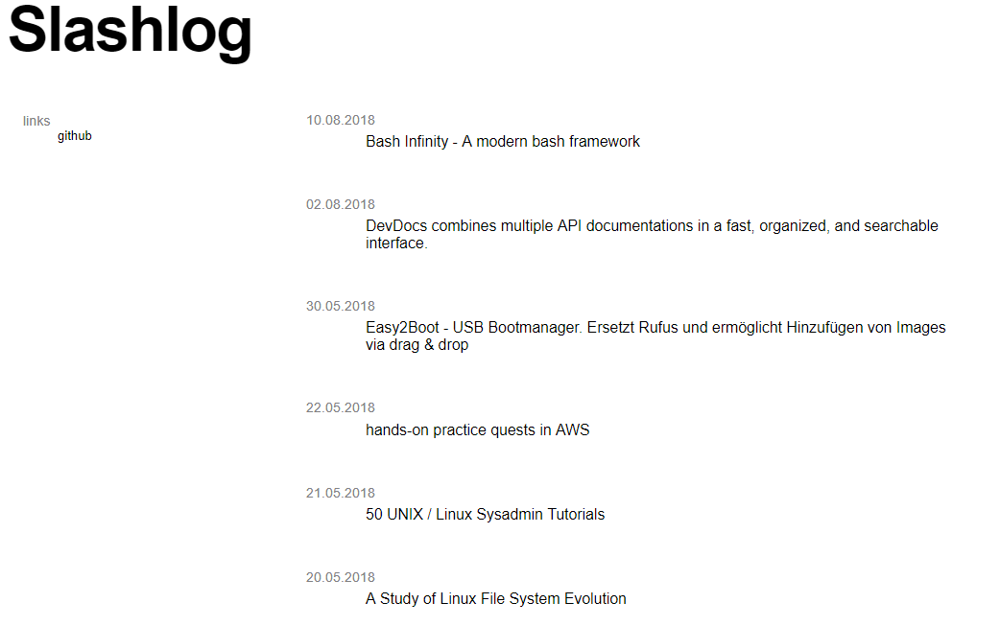

# Bashblog

## Intro

bashblog is a static blog generator, link list and knowledge base. It solves a simple problem: How to preserve the thought or a summary of an article or video.

bashblog receives links and videos via email and stores a text connected to it. This way an article and the gained knowledge keeps its value.


_Share via mail_ is available on every platform, in every app and tool. E-mail is lightweight and works everywhere, even in the subway.


By storing whole sentences it becomes searchable and even indexable by Google.

bashblog started as a simple script, but by [publishing it to GitHub](https://github.com/6uhrmittag/bashblog), it thought me much more than scripting.

## Naming your baby

Ownership is important when it comes to responsibility and motivation. By naming a tool, it becomes a thing. A thing that can be loved.


By choosing a pretty name it becomes harder to abandon it


you don’t want your baby to crash and fail during tests.

Naming can also be a hard part. Suddenly it becomes real - it’s a choice that requires responsibility. Naming forces you also to think about the future of your tool. Does it need a domain for documentation? Could a Github organisation be useful? Docker, Twitter, pypi?! [namechk ](https://namechk.com/)is a nice tool to check availability on multiple platforms.

Finding the name can take time and so, can distract you from further development, but it shouldn't. Using name generators, browsing domain registrar websites and simply asking friends can help to accelerate the process. 

Once a pretty name is found, wait a day, register accounts and just go with it.

Finding a name for bashblog was pretty easy. It's written in bash, its a blog. There are similarly named projects, but since I've never had the intention to make a huge project out of it, it only needed a[ Github repo.](https://github.com/6uhrmittag/bashblog)

